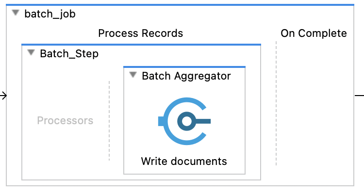

The MarkLogic MuleSoft connector supports writing batches of documents of any type to MarkLogic in a scalable, 
performant manner via Mule's [support for batch processing](https://docs.mulesoft.com/mule-runtime/latest/batch-processing-concept). 
While using Mule's batch processing support is not required, it is recommended regardless of the amount of data that
your flow will write to MarkLogic.

## Table of contents
{: .no_toc .text-delta }

- TOC
{:toc}

## Configuring the operation

Once your flow has a source of data, you can add support for writing documents to MarkLogic. The following steps 
describe how to do so within Mule's batch processing feature (note that these steps are describing one approach; 
please see the Mule documentation for complete information in its batch processing feature):

1. In the Mule Palette, click on the "Core" module and drag a "Batch Job" into your flow. 
2. From the "Core" module, drag a "Batch Aggregator" into the "Aggregator" area in the "Batch_Step" in your flow.
3. Configure the "Batch Aggregator" by specifying an "Aggregator Size" (i.e. the maximum number of documents to send to MarkLogic 
in one call); 100 is a good default value. 
4. In the Mule Palette, click on the "MarkLogic" module and drag a "Write Documents" operation into the "Batch Aggregator". 
5. Under "Basic Settings" for the "Write Documents" instance, select a [MarkLogic Connection Configuration](connection-guide.md).
6. In general, the value of "Content" should be `payload` so that the payload of the incoming Mule messages becomes the
content of the documents written to MarkLogic.

After performing the above steps, you should have a batch job in your flow similar to this:

You can now configure the rest of the "Write Documents" operation based on your requirements. 

## Accessing inline help

Upon clicking into each text field in the "Write Documents" operation, Anypoint will display a small information icon 
to the left of the field. You can hover over this to view a description of the text field. For dropdown fields, you 
can hover over the dropdown to view a description of the field.

## Recommendations for writing documents

The following guidelines are recommended for configuring how documents are written by the connector:

1. Unless you are authenticating as a user with the MarkLogic "admin" role, you must configure at least one permission
with a capability of "update". 
2. You can configure a URI for each document using a [Mule DataWeave expression](https://docs.mulesoft.com/mule-runtime/4.4/dataweave). 
This can be done with in the "URI Prefix" or "URI Suffix" field. You will likely want to set "Generate UUID" to `False`
as well unless you still want a UUID to be present in each URI.
3. The "Temporal Collection" field should be set when using [MarkLogic's temporal documents feature](https://docs.marklogic.com/guide/temporal/intro).
4. The "Quality" field [affects MarkLogic search results](https://docs.marklogic.com/guide/search-dev/relevance#id_68032); it can 
typically be left as zero until your requirements indicate a need to set this to a positive or negative value.
5. A [MarkLogic REST transform](https://docs.marklogic.com/guide/rest-dev/transforms) can be referenced via the "Transform"
field. This is a flexible approach for adjusting the contents of a document before it is written to MarkLogic.

